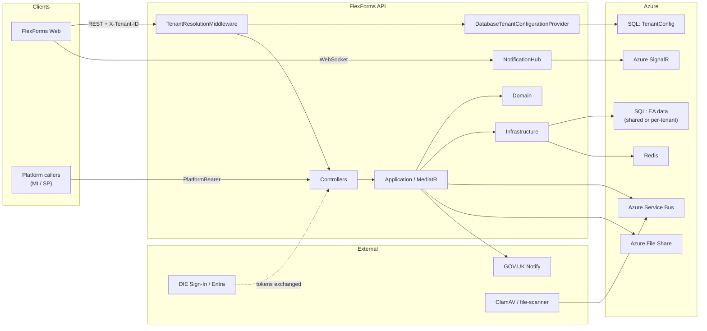
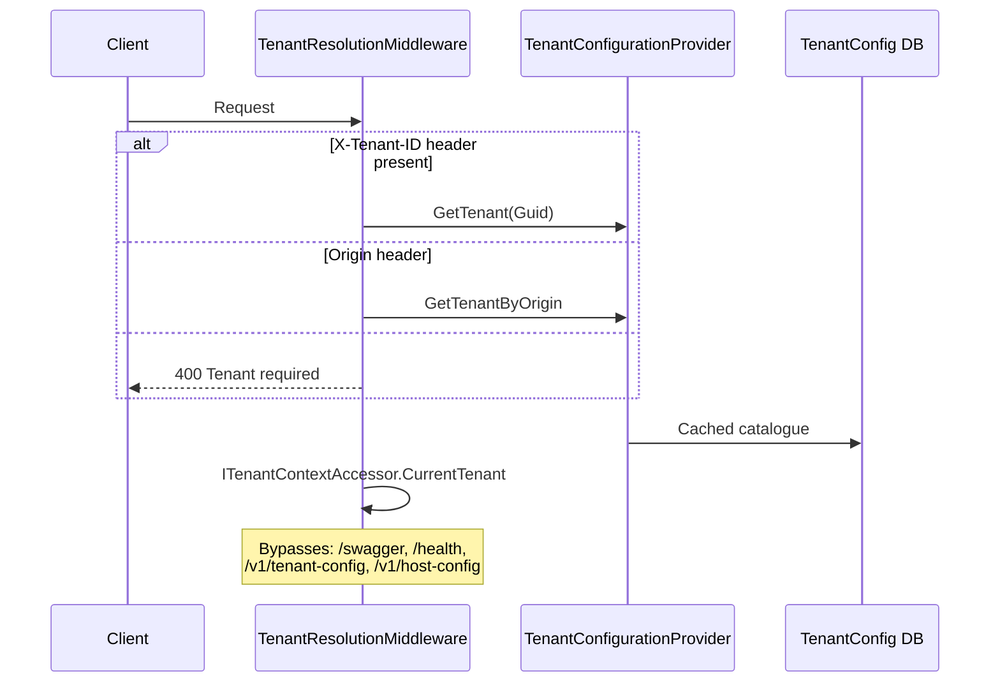
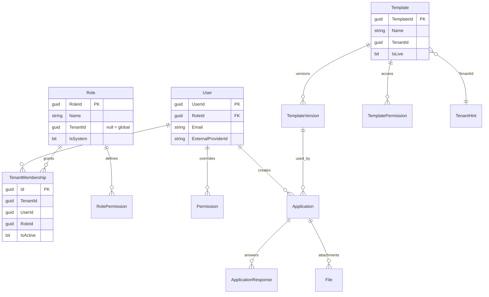
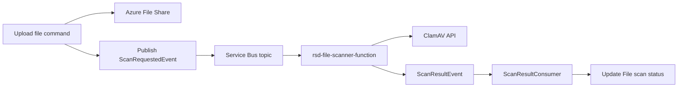

# FlexForms API

Backend for **FlexForms** — a multi-tenant, template-driven form platform for GOV.UK services.

Tenants (products such as Transfers, Visits, LSRP) share one API. Each tenant’s configuration, auth, connection strings, and form templates are stored in the database and resolved per request. The companion frontend is [flexforms-web](https://github.com/DFE-Digital/flexforms-web).

---

## Features

- **Multi-tenant SaaS** — TenantConfig database + per-tenant EA data; hostname / `X-Tenant-ID` / Origin resolution
- **JSON template engine** — Versioned schemas rendered by the Web form engine
- **Roles & permissions** — SuperAdmin (platform), Admin / User / custom roles (tenant), claim-based grants
- **Token exchange** — DfE Sign-In / Entra SSO / test / internal service → tenant-scoped API JWT
- **Secure files** — Azure File Share + ClamAV scan via Azure Service Bus
- **GOV.UK Notify** — Email for submit, invites, feedback
- **Real-time notifications** — Azure SignalR
- **Audit** — SQL Server temporal tables on `ea` entities
- **Redis + memory cache** — Tenant-prefixed keys
- **NSwag Api.Client** — Strongly typed .NET client for Web and other consumers

---

## Architecture overview

Clean Architecture / DDD:

| Layer | Project | Purpose |
|-------|---------|---------|
| Presentation | `GovUK.Dfe.FlexForms.Api` | REST, SignalR, auth, middleware, Swagger |
| Application | `GovUK.Dfe.FlexForms.Application` | MediatR CQRS, validators, consumers, domain event handlers |
| Domain | `GovUK.Dfe.FlexForms.Domain` | Aggregates, tenancy entities, interfaces, role rules |
| Infrastructure | `GovUK.Dfe.FlexForms.Infrastructure` | EF Core, migrations, tenant config provider, encryptor |
| Utilities | `GovUK.Dfe.FlexForms.Utils` | Shared helpers |
| Client SDK | `GovUK.Dfe.FlexForms.Api.Client` | Generated HTTP client + token exchange handlers |



### Dual-database model

| Database | EF context | Schema | Contents |
|----------|------------|--------|----------|
| **TenantConfig** | `TenantConfigDbContext` | `tenantconfig` | Tenants, settings JSON, hostnames, frontend origins, principals |
| **EA** | `ExternalApplicationsContext` | `ea` | Users, roles, memberships, templates, applications, files, permissions |

Host always uses `ConnectionStrings:TenantConfigDatabase`. Each tenant’s EA connection comes from TenantSettings category `ConnectionStrings` (Target Shared/Api) → `DefaultConnection`. Tenants may share one EA database or use isolated DBs.

---

## Multi-tenancy

### How a request gets a tenant



1. Prefer **`X-Tenant-ID`** (GUID).
2. Else map **`Origin`** → `TenantFrontendOrigins`.
3. Set scoped `ITenantContextAccessor` and use that tenant’s EA connection string.

**Hostname resolve** (for Web bootstrap): `GET /v1/tenant-config/resolve?hostname=` uses `TenantHostnames` (no scheme).

### TenantConfig tables

| Table | Purpose |
|-------|---------|
| `Tenants` | Id, Name, IsActive |
| `TenantSettings` | Category × Target (`Shared` / `Api` / `Web`) JSON; `IsSecret` encrypted |
| `TenantHostnames` | Host → tenant (e.g. `transfers.dev-flexforms…`) |
| `TenantFrontendOrigins` | CORS origins |
| `TenantPrincipals` | Managed Identity / SP / API key object id → tenant (config consume) |

### TenantSettings targets

| Target | Used by |
|--------|---------|
| `Shared` | Merged into both Api and Web config snapshots |
| `Api` | API runtime (`DatabaseTenantConfigurationProvider`, target `Api`) |
| `Web` | Consumed by Web via `GET /v1/tenant-config/tenants/{id}?target=Web` |

Common categories: `ConnectionStrings`, `AzureAd`, `DfESignIn`, `EntraSso`, `Authorization`, `ApplicationTemplates`, `Email`, `FileStorage`, `FormEngine` (Web), `Layout` (Web), `InternalServiceAuth`, …

Secrets (`IsSecret = 1`) are encrypted with ASP.NET Data Protection.

### Configuration provider

`DatabaseTenantConfigurationProvider` (hosted service):

- Loads active tenants + settings on a timer (~60s) and on `POST /v1/admin/tenants/refresh`
- Decrypts secrets, flattens JSON into `IConfiguration` on `TenantConfiguration`
- Indexes by tenant Id and frontend origin
- Notifies auth registry / OIDC reloaders on change

Tests / codegen can use `TenantConfigSource=AppSettings` + `OptionsTenantConfigurationProvider`.

### TenantPrincipals

Maps Azure AD **oid** / **appid** of a workload identity to a tenant. Used when Web (or another service) calls `GET /v1/tenant-config` — the tenant is resolved from the caller’s JWT, never trusted from a client-supplied id alone.

---

## Authentication and authorisation

### Schemes

| Scheme | Use |
|--------|-----|
| `CompositeScheme` | Default; dispatches ApiKey / mTLS / `TenantBearer` |
| `TenantBearer` | User JWTs (HS256 from TokenSettings) + Entra service tokens |
| `ApiKey` | `X-Api-Key` |
| `Mtls` | Client certificate |
| `PlatformBearer` | Platform Entra app (`Platform:AzureAd`) for host-config / tenant-config ops |
| `HubCookie` | Short-lived cookie for SignalR |

### Token exchange

`POST /v1/tokens/exchange` (policy `ServiceCallers`):

1. Caller presents a machine credential + subject IdP token (DfE Sign-In / Entra SSO / test / internal headers).
2. API validates the subject, finds or creates `User`, ensures `TenantMembership`.
3. Issues a tenant-scoped user JWT with role + permission claims.

Web’s Api.Client uses this on every user session (`RequestTokenExchange`).

### Roles

| Role | Scope | Notes |
|------|-------|-------|
| **SuperAdmin** | Platform | Well-known global role id / name `SuperAdmin`. Tenant Settings UI/API. Not tenant-assignable. |
| **Admin** | Tenant | Per-tenant `Roles` row (`TenantId` set). Full tenant admin. Assignable by SuperAdmin. |
| **User** | Tenant | Default self-registration membership. |
| **Custom** | Tenant | Named roles + `RolePermissions`. |
| **Caseworker** | Legacy | Not assignable; prefer custom roles. |

**Important:** Global `Roles` row named `Admin` with `TenantId = NULL` is the **platform SuperAdmin** shell (`RoleConstants.AdminRoleId`). Tenant Admin assignment must use the **tenant-scoped** Admin `RoleId`, never that global id.

Source of truth for “who is Admin in this tenant”: **`TenantMemberships`** → tenant role. Token exchange elevates to SuperAdmin when `Users.RoleId` is the platform admin GUID.

### Permission claims

Format: `{ResourceType}:{ResourceKey}:{AccessType}`  
Examples: `Template:Any:Manage`, `User:Any:Manage`, `Template:{guid}:Read`.

Merged from `RolePermissions` + user `Permissions` overrides (`UserPermissionClaimProvider`). Evaluated by `PermissionClaimEvaluator` / policy handlers (`CanManageUsers`, `CanCreateTemplate`, …).

### Tenant consistency

Bearer claim `tenant_id` must match the resolved request tenant. Cross-tenant tokens are rejected.

---

## Domain model (`ea`)



Templates belong to a tenant via `Template.TenantId` and/or TenantSettings HostMappings (`ApplicationTemplates` / Web `Template`). Catalogue logic: `TenantTemplateCatalogue`.

---

## API surface (v1)

| Area | Prefix | Examples |
|------|--------|----------|
| Applications | `/v1/applications`, `/v1/me/applications` | Create, responses, submit, contributors, files |
| Templates | `/v1/templates` | CRUD versions, live flag, grant-all-users |
| Users | `/v1/users` | Register, assign role, tenant users, permissions |
| Roles | `/v1/roles` | Custom roles + RolePermissions |
| Tokens | `/v1/tokens/exchange` | IdP → API JWT |
| Notifications | `/v1/notifications` | Redis-backed notifications |
| Tenant admin | `/v1/admin/tenants` | Refresh, list, seed, get/upsert settings |
| Tenant config | `/v1/tenant-config` | Consume config, resolve hostname, get by id |
| Host config | `/v1/host-config` | Platform bootstrap for Web |
| Hub auth | hub ticket endpoints | SignalR cookie bridge |
| Feedback | `/v1/userfeedback` | Support / feedback emails |

Swagger: `https://localhost:7089/swagger` (see `launchSettings.json`).

---

## Messaging, files, SignalR



- **Shared** Service Bus namespace and SignalR resource for all tenants; tenant stamped on messages (`TenantAwareEventPublisher` / `TenantContextConsumeFilter`).
- File storage is tenant-aware (`TenantAwareFileStorageService`).

---

## Application layer patterns

- **MediatR** commands/queries with FluentValidation, rate limiting, exception behaviours.
- Feature folders: `Applications`, `Templates`, `Users`, `Roles`, `TenantAdmin`, `TenantConfig`, `Notifications`, `Consumers`.
- Domain events → handlers (email, scan request, cache invalidation).
- Key services: `TenantMembershipService`, `TenantRoleService`, `RolePermissionService`, `ClaimBasedPermissionCheckerService`, `TenantTemplateCatalogue`.

---

## Local development

### Prerequisites

- .NET 10 SDK
- Access to TenantConfig SQL (+ EA SQL if not using LocalDB)
- Redis (or configure memory-only for smoke tests)
- User secrets for platform Entra + connection strings

### Configuration

| Key | Purpose |
|-----|---------|
| `ConnectionStrings:TenantConfigDatabase` | TenantConfig SQL |
| `TenantConfigSource` | `Database` (default) or `AppSettings` |
| `Platform:AzureAd` | Platform Bearer for host/tenant-config |
| `MassTransit` / Service Bus | Messaging (or `SkipMassTransit` for codegen) |
| `DataProtection` | Secret settings encryption |

Per-tenant secrets and connections live in **TenantConfig**, not only in appsettings.

### Run

```bash
dotnet run --project src/GovUK.Dfe.FlexForms.Api
```

HTTPS: `https://localhost:7089`

After editing TenantSettings in SQL, call:

```http
POST /v1/admin/tenants/refresh
```

(as an interactive Admin/SuperAdmin user JWT), or wait for the provider refresh interval.

### Migrations

```bash
# EA schema (ea)
dotnet ef migrations add <Name> --project src/GovUK.Dfe.FlexForms.Infrastructure --context ExternalApplicationsContext

# TenantConfig schema
dotnet ef migrations add <Name> --project src/GovUK.Dfe.FlexForms.Infrastructure --context TenantConfigDbContext --output-dir Migrations/TenantConfig
```

### Scripts

See `scripts/` for TenantConfig import helpers (Web/Api settings upsert). Ensure HostMappings only list that tenant’s template GUIDs on shared EA databases.

---

## Security checklist

| Concern | Behaviour |
|---------|-----------|
| Tenant isolation | Middleware + `tenant_id` claim match + membership checks |
| Config consume | Principal → `TenantPrincipals` (no client-chosen tenant) |
| Secret settings | Encrypted at rest; SuperAdmin-only read/write decrypted values |
| Admin APIs | Interactive user JWT required where noted (not pure machine tokens) |
| CORS | Only `TenantFrontendOrigins` |
| Platform ops | `PlatformBearer` + Entra app roles (`Platform.Host.Read`, `Platform.TenantConfig.Read`) |
| Permissions | Claim policies; Admin bypass within tenant |

---

## Related repositories

| Repo | Role |
|------|------|
| [flexforms-web](https://github.com/DFE-Digital/flexforms-web) | Razor Pages UI + form engine |
| [rsd-file-scanner-function](https://github.com/DFE-Digital/rsd-file-scanner-function) | AV scan worker |
| [rsd-clamav-api](https://github.com/DFE-Digital/rsd-clamav-api) | ClamAV sidecar/API |
| [DfE.CoreLibs](https://github.com/DFE-Digital/DfE.CoreLibs) | Shared contracts, security, caching |

---

## Tests

```bash
dotnet test GovUK.Dfe.FlexForms.Api.sln
```

Unit + integration projects under `src/Tests/`.
