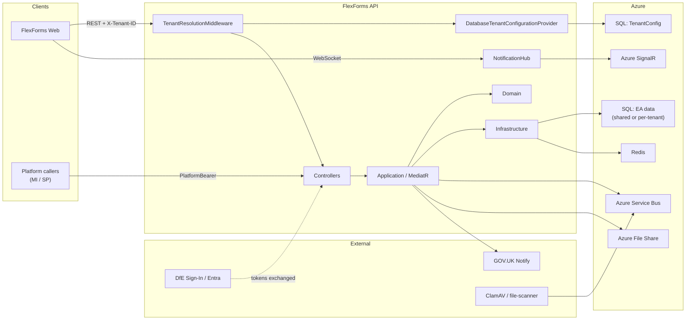
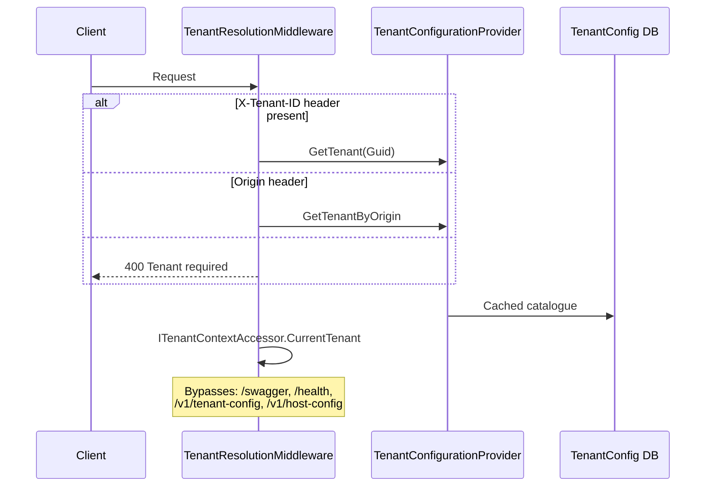
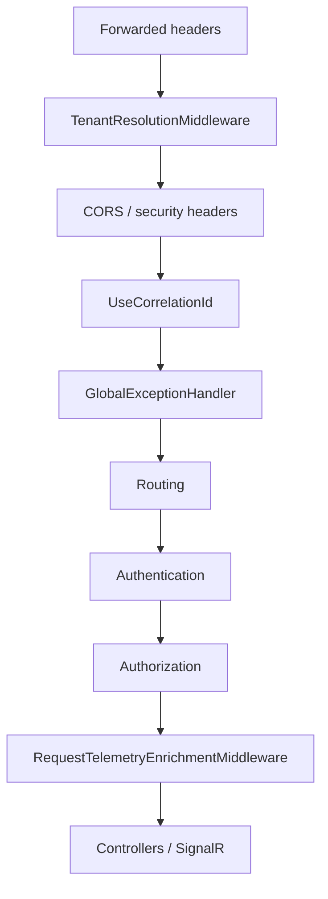
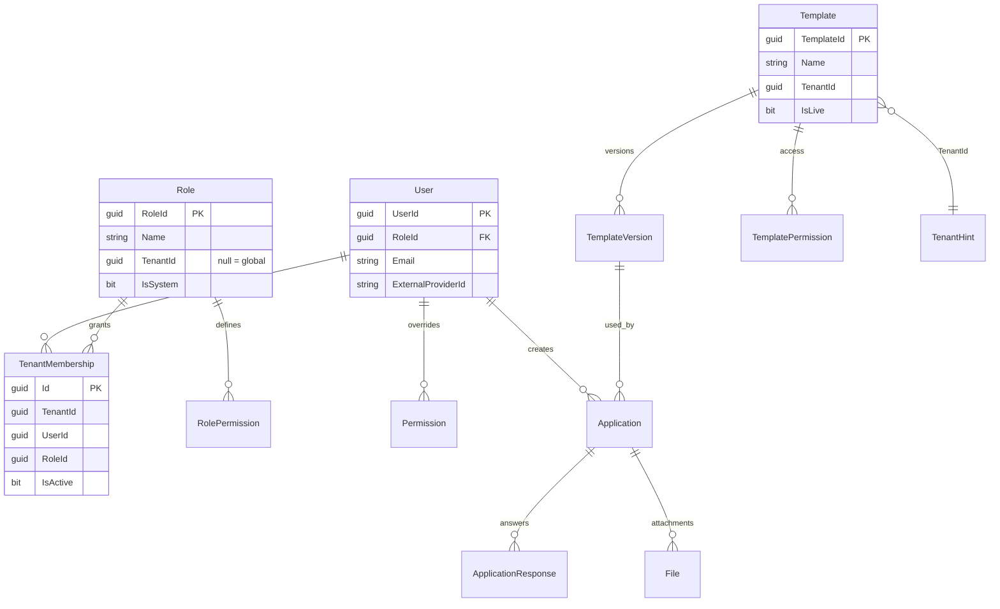
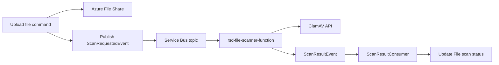
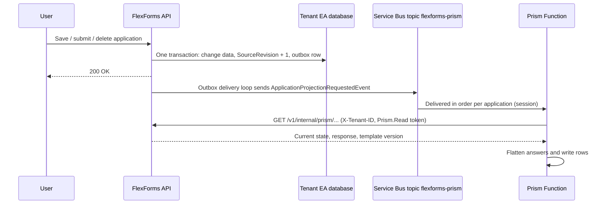
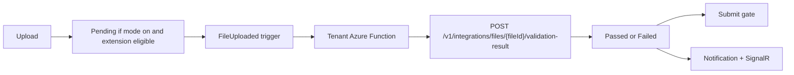

# FlexForms API

Backend for **FlexForms** — a multi-tenant, template-driven form platform for GOV.UK services.

Tenants (products such as Transfers, Visits, LSRP) share one API. Each tenant’s configuration, auth, connection strings, and form templates are stored in the database and resolved per request. The companion frontend is [flexforms-web](https://github.com/DFE-Digital/flexforms-web).

---

## Features

- **Multi-tenant SaaS** — TenantConfig database + per-tenant EA data; hostname / `X-Tenant-ID` / Origin resolution
- **JSON template engine** — Versioned schemas rendered by the Web form engine
- **Roles & permissions** — SuperAdmin (platform), Admin / User / custom roles (tenant), claim-based grants
- **Token exchange** — DfE Sign-In / Entra SSO / test / internal service → tenant-scoped API JWT
- **Secure files** — Azure File Share + ClamAV scan via Azure Service Bus
- **Tenant file validation** — Optional per-template callback; status + SignalR notify the uploader
- **GOV.UK Notify** — Email for submit, invites, feedback; optional TenantConfig `EmailPlaceholderMappings` for custom personalisation from form answers
- **Prism analytics feed** — Every save, submit and delete is published (atomically, via the outbox) for the Prism projection, which reads the data back through internal read-only endpoints ([details](#prism-analytics-projection))
- **Real-time notifications** — Azure SignalR
- **Audit** — SQL Server temporal tables on `ea` entities
- **Redis + memory cache** — Tenant-prefixed keys
- **NSwag Api.Client** — Strongly typed .NET client for Web and other consumers
- **Request tracing** — Correlation id, structured Serilog → Application Insights, enriched `ExceptionResponse`, login audit logs

---

## Architecture overview

Clean Architecture / DDD:

| Layer | Project | Purpose |
|-------|---------|---------|
| Presentation | `GovUK.Dfe.FlexForms.Api` | REST, SignalR, auth, middleware, Swagger |
| Application | `GovUK.Dfe.FlexForms.Application` | MediatR CQRS, validators, consumers, domain event handlers |
| Domain | `GovUK.Dfe.FlexForms.Domain` | Aggregates, tenancy entities, interfaces, role rules |
| Infrastructure | `GovUK.Dfe.FlexForms.Infrastructure` | EF Core, migrations, tenant config provider, encryptor |
| Utilities | `GovUK.Dfe.FlexForms.Utils` | Shared helpers |
| Client SDK | `GovUK.Dfe.FlexForms.Api.Client` | Generated HTTP client + token exchange handlers |


```mermaid
flowchart LR
    subgraph Clients
        Web["FlexForms Web"]
        Platform["Platform callers<br/>(MI / SP)"]
    end

    subgraph Azure
        SB["Azure Service Bus"]
        FS["Azure File Share"]
        ASR["Azure SignalR"]
        Redis["Redis"]
        SQL_TC["SQL: TenantConfig"]
        SQL_EA["SQL: EA data<br/>(shared or per-tenant)"]
    end

    subgraph External
        Notify["GOV.UK Notify"]
        ClamAV["ClamAV / file-scanner"]
        IdP["DfE Sign-In / Entra"]
    end

    subgraph API["FlexForms API"]
        MW["TenantResolutionMiddleware"]
        Ctrl["Controllers"]
        Hub["NotificationHub"]
        App["Application / MediatR"]
        Dom["Domain"]
        Infra["Infrastructure"]
        TCP["DatabaseTenantConfigurationProvider"]
    end

    Web -->|REST + X-Tenant-ID| MW
    Web -->|WebSocket| Hub
    Platform -->|PlatformBearer| Ctrl
    MW --> TCP
    TCP --> SQL_TC
    MW --> Ctrl
    Ctrl --> App
    App --> Dom
    App --> Infra
    Infra --> SQL_EA
    Infra --> Redis
    Hub --> ASR
    App --> SB
    App --> FS
    App --> Notify
    ClamAV --> SB
    IdP -.->|tokens exchanged| Ctrl
```

### Dual-database model

| Database | EF context | Schema | Contents |
|----------|------------|--------|----------|
| **TenantConfig** | `TenantConfigDbContext` | `tenantconfig` | Tenants, settings JSON, hostnames, frontend origins, principals |
| **EA** | `ExternalApplicationsContext` | `ea` | Users, roles, memberships, templates, applications, files, permissions |

Host always uses `ConnectionStrings:TenantConfigDatabase`. Each tenant’s EA connection comes from TenantSettings category `ConnectionStrings` (Target Shared/Api) → `DefaultConnection`. Tenants may share one EA database or use isolated DBs.

---

## Multi-tenancy

### How a request gets a tenant


```mermaid
sequenceDiagram
    participant Client
    participant MW as TenantResolutionMiddleware
    participant TCP as TenantConfigurationProvider
    participant TC as TenantConfig DB

    Client->>MW: Request
    alt X-Tenant-ID header present
        MW->>TCP: GetTenant(Guid)
    else Origin header
        MW->>TCP: GetTenantByOrigin
    else
        MW-->>Client: 400 Tenant required
    end
    TCP->>TC: Cached catalogue
    MW->>MW: ITenantContextAccessor.CurrentTenant
    Note over MW: Bypasses: /swagger, /health,<br/>/v1/tenant-config, /v1/host-config
```

1. Prefer **`X-Tenant-ID`** (GUID).
2. Else map **`Origin`** → `TenantFrontendOrigins`.
3. Set scoped `ITenantContextAccessor` and use that tenant’s EA connection string.

**Hostname resolve** (for Web bootstrap): `GET /v1/tenant-config/resolve?hostname=` uses `TenantHostnames` (no scheme).

### TenantConfig tables

| Table | Purpose |
|-------|---------|
| `Tenants` | Id, Name, IsActive |
| `TenantSettings` | Category × Target (`Shared` / `Api` / `Web`) JSON; `IsSecret` encrypted |
| `TenantHostnames` | Host → tenant (e.g. `transfers.dev-flexforms…`) |
| `TenantFrontendOrigins` | CORS origins |
| `TenantPrincipals` | Managed Identity / SP / API key object id → tenant (config consume) |

### TenantSettings targets

| Target | Used by |
|--------|---------|
| `Shared` | Merged into both Api and Web config snapshots |
| `Api` | API runtime (`DatabaseTenantConfigurationProvider`, target `Api`) |
| `Web` | Consumed by Web via `GET /v1/tenant-config/tenants/{id}?target=Web` |

Common categories: `ConnectionStrings`, `AzureAd`, `DfESignIn`, `EntraSso`, `Authorization`, `ApplicationTemplates`, `Email`, `EmailTemplates`, `EmailPlaceholderMappings`, `EventMappings`, `EventTriggers`, `SchemaEvents`, `FileStorage`, `FileValidation`, `FormEngine` (Web), `Layout` (Web), `InternalServiceAuth`, …

**SuperAdmin-only (cannot be edited by Tenant Admins):** `ConnectionStrings`, `ApplicationTemplates`, `Template`, `FileStorage`, `Email`.

Secret categories (`IsSecret = 1`, and forced-secret categories such as `ConnectionStrings`, auth providers, and `Email`) are encrypted with ASP.NET Data Protection at rest.

**Admin list / validate APIs never return secret leaf values as plaintext** to Tenant Admins. Secret-looking JSON properties (and all `ConnectionStrings` values) are replaced with `__REDACTED__`; non-secret properties stay readable. Upsert restores any `__REDACTED__` leaf from the currently stored value so Admins can save non-secret edits without wiping secrets. Typing a new plaintext value in place of a sentinel rotates that leaf.

| Caller | Environment | Secret leaves in list/validate |
|--------|-------------|-------------------------------|
| Tenant Admin | Any | `__REDACTED__` |
| SuperAdmin | Dev / Test / Local / Development / Testing | Plaintext |
| SuperAdmin | Production / Staging / unknown | `__REDACTED__` |

Break-glass (Production SuperAdmin): `POST /v1/admin/tenants/{id}/settings/reveal` with `category`, `target`, `path`, and `reason`. Audited as `SecretRevealed` (path + reason only). Rate-limited.

Operator detail: [flexforms-web Tenant Admin User Manual §14.4](https://github.com/DFE-Digital/flexforms-web/blob/main/docs/Tenant-Admin-User-Manual.md#144-how-secrets-are-shown-and-saved).

### Configuration provider

`DatabaseTenantConfigurationProvider` (hosted service):

- Loads active tenants + settings on a timer (~60s) and on `POST /v1/admin/tenants/refresh`
- Decrypts secrets, flattens JSON into `IConfiguration` on `TenantConfiguration`
- Indexes by tenant Id and frontend origin
- Notifies auth registry / OIDC reloaders on change

Tests / codegen can use `TenantConfigSource=AppSettings` + `OptionsTenantConfigurationProvider`.

### TenantPrincipals

Maps Azure AD **oid** / **appid** of a workload identity to a tenant. Used when Web (or another service) calls `GET /v1/tenant-config` — the tenant is resolved from the caller’s JWT, never trusted from a client-supplied id alone.

---

## Authentication and authorisation

### Schemes

| Scheme | Use |
|--------|-----|
| `CompositeScheme` | Default; dispatches ApiKey / mTLS / `TenantBearer` |
| `TenantBearer` | User JWTs (HS256 from TokenSettings) + Entra service tokens |
| `ApiKey` | `X-Api-Key` |
| `Mtls` | Client certificate |
| `PlatformBearer` | Platform Entra app (`Platform:AzureAd`) for host-config / tenant-config ops and the internal Prism endpoints (`Prism.Read` role) |
| `HubCookie` | Short-lived cookie for SignalR |

### Token exchange

`POST /v1/tokens/exchange` (policy `ServiceCallers`):

1. Caller presents a machine credential + subject IdP token (DfE Sign-In / Entra SSO / test / internal headers).
2. API validates the subject, finds or creates `User`, ensures `TenantMembership`.
3. Issues a tenant-scoped user JWT with role + permission claims.

Web’s Api.Client uses this on every user session (`RequestTokenExchange`).

**Login audit:** successful exchange logs `UserEmail`, `TenantId`, `TenantName`, `Role`, and `TemplateCount` (structured properties for App Insights).

### Roles

| Role | Scope | Notes |
|------|-------|-------|
| **SuperAdmin** | Platform | Well-known global role id / name `SuperAdmin`. Tenant Settings UI/API. Not tenant-assignable. |
| **Admin** | Tenant | Per-tenant `Roles` row (`TenantId` set). Full tenant admin. Assignable by SuperAdmin. |
| **User** | Tenant | Default self-registration membership. Form access: none if no live template; the one live template if exactly one; otherwise none unless `SelfRegistration:DefaultTemplateId` (or `ExternalApplicationsApiClient:DefaultTemplateId`) is a live form. |
| **Custom** | Tenant | Named roles + `RolePermissions`. |
| **Caseworker** | Legacy | Not assignable; prefer custom roles. |

**Important:** Global `Roles` row named `Admin` with `TenantId = NULL` is the **platform SuperAdmin** shell (`RoleConstants.AdminRoleId`). Tenant Admin assignment must use the **tenant-scoped** Admin `RoleId`, never that global id.

Source of truth for “who is Admin in this tenant”: **`TenantMemberships`** → tenant role. Token exchange elevates to SuperAdmin when `Users.RoleId` is the platform admin GUID.

### Permission claims

Format: `{ResourceType}:{ResourceKey}:{AccessType}`  
Examples: `Template:Any:Manage`, `User:Any:Manage`, `Template:{guid}:Read`.

Merged from `RolePermissions` + user `Permissions` overrides (`UserPermissionClaimProvider`). Evaluated by `PermissionClaimEvaluator` / policy handlers (`CanManageUsers`, `CanCreateTemplate`, …).

### Tenant consistency

Bearer claim `tenant_id` must match the resolved request tenant. Cross-tenant tokens are rejected.

---

## Observability and request tracing

Structured logging uses **Serilog** with `Enrich.FromLogContext()` and an Application Insights sink (`Telemetry/ExceptionTrackingTelemetryConverter`). The default App Insights `ILogger` provider is disabled so exceptions and traces share one pipeline with searchable `customDimensions`.

### CoreLibs building blocks

From `GovUK.Dfe.CoreLibs.Http` (local project reference in dev; NuGet in CI):

| Component | Role |
|-----------|------|
| `AddCorrelationId()` / `UseCorrelationId()` | Registers `ICorrelationContext` + `IRequestTelemetryContext`; ensures `x-correlationId` header |
| `GlobalExceptionHandlerMiddleware` | Standard JSON errors, **ErrorId**, merges telemetry onto `ExceptionResponse` |
| `LogContextKeys` | Canonical scope names: `CorrelationId`, `ErrorId`, `TenantId`, `TenantName`, `UserEmail`, `UserId`, `ServiceName` |
| `ExceptionResponse` | First-class `tenantId`, `tenantName`, `userEmail`, `correlationId`; product extras in `context` |

Product-specific dimensions (`TemplateId`, `ApplicationReference`, …) are **not** in CoreLibs — see FlexForms types below.

### FlexForms telemetry (API)

| Type | Location | Purpose |
|------|----------|---------|
| `RequestTelemetryEnrichmentMiddleware` | After `UseAuthentication` / `UseAuthorization` | Fills CoreLibs + FlexForms scopes for all subsequent logs |
| `IFlexFormsRequestScope` | `Telemetry/FlexFormsRequestScope.cs` | `TemplateId`, `ApplicationId`, `ApplicationReference` |
| `FlexFormsLogContextKeys` | `Telemetry/FlexFormsLogContextKeys.cs` | App Insights property names for form context |
| `ExceptionTrackingTelemetryConverter` | `Telemetry/` | Prefers Serilog structured properties; regex fallback only |
| `HeaderForwardingHandler` (Api.Client) | Forwards `X-Template-Id`, `X-Application-Reference` from Web session/headers |

`SharedPostProcessingAction` on the global exception handler copies FlexForms scope into `ExceptionResponse.Context` so Web filters can log `TemplateId` from API errors.

### Request pipeline (middleware order)


```mermaid
flowchart TD
    A[Forwarded headers] --> B[TenantResolutionMiddleware]
    B --> C[CORS / security headers]
    C --> D[UseCorrelationId]
    D --> E[GlobalExceptionHandler]
    E --> F[Routing]
    F --> G[Authentication]
    G --> H[Authorization]
    H --> I[RequestTelemetryEnrichmentMiddleware]
    I --> J[Controllers / SignalR]
```

Tenant resolution scopes `TenantId` / `TenantName` early; enrichment after auth adds user claims and template/application headers from Web.

### ExceptionResponse shape (client / support)

```json
{
  "errorId": "P-123456",
  "statusCode": 500,
  "message": "Something went wrong",
  "correlationId": "550e8400-e29b-41d4-a716-446655440000",
  "tenantId": "...",
  "tenantName": "...",
  "userEmail": "user@example.org",
  "context": {
    "TemplateId": "...",
    "ApplicationReference": "..."
  }
}
```

### Support queries (Application Insights)

```kusto
union traces, exceptions
| where customDimensions.CorrelationId == "<guid>"
| project timestamp, cloud_RoleName, message,
          customDimensions.ErrorId, customDimensions.TenantId,
          customDimensions.UserEmail, customDimensions.TemplateId
| order by timestamp asc
```

More examples: `DfE.CoreLibs.Http/ExceptionHandler.md` in the CoreLibs repo.

---

## Domain model (`ea`)


```mermaid
erDiagram
    User ||--o{ TenantMembership : has
    Role ||--o{ TenantMembership : grants
    Role ||--o{ RolePermission : defines
    User ||--o{ Permission : overrides
    User ||--o{ Application : creates
    Template ||--o{ TemplateVersion : versions
    Template ||--o{ TemplatePermission : access
    TemplateVersion ||--o{ Application : used_by
    Application ||--o{ ApplicationResponse : answers
    Application ||--o{ File : attachments
    Template }o--|| TenantHint : TenantId

    User {
        guid UserId PK
        guid RoleId FK
        string Email
        string ExternalProviderId
    }
    Role {
        guid RoleId PK
        string Name
        guid TenantId "null = global"
        bit IsSystem
    }
    TenantMembership {
        guid Id PK
        guid TenantId
        guid UserId
        guid RoleId
        bit IsActive
    }
    Template {
        guid TemplateId PK
        string Name
        guid TenantId
        bit IsLive
    }
```

Templates belong to a tenant via `Template.TenantId` and/or TenantSettings HostMappings (`ApplicationTemplates` / Web `Template`). Catalogue logic: `TenantTemplateCatalogue`.

---

## API surface (v1)

| Area | Prefix | Examples |
|------|--------|----------|
| Applications | `/v1/applications`, `/v1/me/applications` | Create, responses, submit, contributors, files |
| Templates | `/v1/templates` | CRUD versions, live flag, grant-all-users |
| Users | `/v1/users` | Register, assign role, tenant users, permissions |
| Roles | `/v1/roles` | Custom roles + RolePermissions |
| Tokens | `/v1/tokens/exchange` | IdP → API JWT |
| Notifications | `/v1/notifications` | Redis-backed notifications |
| Tenant admin | `/v1/admin/tenants` | Refresh, list, seed, get/upsert settings |
| Tenant config | `/v1/tenant-config` | Consume config, resolve hostname, get by id |
| Host config | `/v1/host-config` | Platform bootstrap for Web |
| Prism (internal) | `/v1/internal/prism` | Read-only source data for the Prism projector; `Prism.Read` platform token only ([details](#internal-endpoints-for-prism)) |
| Hub auth | hub ticket endpoints | SignalR cookie bridge |
| Feedback | `/v1/userfeedback` | Support / feedback emails |

Swagger: `https://localhost:7089/swagger` (see `launchSettings.json`).

---

## Messaging, files, SignalR


```mermaid
flowchart LR
    Upload["Upload file command"] --> FS["Azure File Share"]
    Upload --> Pub["Publish ScanRequestedEvent"]
    Pub --> SB["Service Bus topic"]
    SB --> Scanner["rsd-file-scanner-function"]
    Scanner --> ClamAV["ClamAV API"]
    Scanner --> SB2["ScanResultEvent"]
    SB2 --> Consumer["ScanResultConsumer"]
    Consumer --> Meta["Update File scan status"]
```

- **Shared** Service Bus namespace and SignalR resource for all tenants; tenant stamped on messages (`TenantAwareEventPublisher` / `TenantContextConsumeFilter`).
- File storage host registration uses `GlobalConfiguration:FileStorage`; runtime paths remain tenant-aware (`TenantAwareFileStorageService`).
- Virus scan (`ScanRequestedEvent`) is platform-owned. Tenant Excel/schema checks use the HTTP callback below — not Service Bus.

### Transactional outbox (per-event)

The API includes the MassTransit EF Core **transactional outbox**. When an event uses it, the message is first saved in the tenant's EA database (`ea.OutboxMessage`), then sent to Service Bus by a background delivery loop that retries until it succeeds. A Service Bus outage no longer loses those messages. The trade-off is **at-least-once** delivery: a message can occasionally arrive twice (with the same `MessageId`).

Because some existing subscribers cannot handle duplicates, the outbox is enabled **per event** through an allowlist. **The default list is empty**, so every current event still publishes directly, exactly as before.

```jsonc
"MassTransit": {
  "Outbox": {
    "Enabled": true,          // master switch; false = no outbox at all (restart required)
    "Mode": "Allowlist",      // Allowlist = only Events below; All = every event
    "Events": [],             // e.g. [ "ApplicationResponseSaved", "ScanRequestedEvent" ]
    "Delivery": {
      "QueryDelay": "00:00:05",            // poll interval when not woken by a new message
      "QueryMessageLimit": 100,            // outboxes processed per sweep
      "MessageDeliveryLimit": 100,         // messages per outbox per pass
      "MessageDeliveryTimeout": "00:00:10" // per-send timeout to Service Bus
    }
  }
}
```

| Setting | Default | Meaning |
|---|---|---|
| `MassTransit:Outbox:Enabled` | `true` | Registers the outbox and its delivery loops. `false` publishes everything directly. |
| `MassTransit:Outbox:Mode` | `Allowlist` | `Allowlist`: only listed events use the outbox. `All`: every event published outside a consumer does. |
| `MassTransit:Outbox:Events` | `[]` | Event identifiers (case-insensitive): typed event class name (for example `ScanRequestedEvent`, `TransferApplicationSubmittedEvent`), or a schema event's `EventType` or `TopicName`. |
| `MassTransit:Outbox:Delivery:*` | see above | Delivery loop tuning; defaults suit normal traffic. `QueryTimeout` (`00:00:30`) is also supported. |

How it fits the platform:

- **Tenant-aware**: rows are stored in the raising tenant's EA database, and `TenantOutboxDeliveryService` runs one delivery loop per distinct tenant EA database with that tenant's context. MassTransit's built-in delivery service is disabled because it would only drain the first tenant's database.
- **Same topics, bodies and headers** (`TenantId`, `TenantName`, custom properties) as direct publishing.
- **Consumers are unaffected**: publishes inside a consumer still use the consume context.
- **Post-commit handlers**: `DomainEventDispatcherInterceptor` does a follow-up save so events published by domain event handlers (which run after commit) reach the outbox. New events needing strict atomicity (Prism) must be published **before** `SaveChangesAsync`.
- The effective routing is logged at startup: `Transactional outbox routing: Mode ..., Events [...]`.

**Before listing an event**, confirm every subscriber of its topic tolerates duplicates, or enable Service Bus duplicate detection on the topic (only possible when the topic is created).

Full guide (configuration reference, rollout runbook, monitoring SQL, troubleshooting): [`docs/transactional-outbox.md`](docs/transactional-outbox.md). Tenant admin guidance: [Tenant Admin User Manual §12.19](https://github.com/DFE-Digital/flexforms-web/blob/main/docs/Tenant-Admin-User-Manual.md#1219-delivery-guarantees-transactional-outbox).

---

## Prism (analytics projection)

[Prism](https://github.com/DFE-Digital/flexforms-prism) turns FlexForms applications into flat, queryable rows in its own SQL database, so analysts can report on form answers without touching the EA databases or parsing response JSON. Prism is a separate Azure Function app. The API's job is small and well-defined:

1. **Tell Prism when an application changes**, by publishing an event to Service Bus.
2. **Let Prism read the source data**, through a handful of read-only internal endpoints.

The event is only a nudge ("application X changed, it is now at revision N"). It carries no form answers. Prism always reads the real data back from the API, so a late, duplicated or out-of-order event can never put wrong data into Prism.


```mermaid
sequenceDiagram
    participant User
    participant API as FlexForms API
    participant EA as Tenant EA database
    participant SB as Service Bus topic flexforms-prism
    participant Prism as Prism Function

    User->>API: Save / submit / delete application
    API->>EA: One transaction: change data, SourceRevision + 1, outbox row
    API-->>User: 200 OK
    API->>SB: Outbox delivery loop sends ApplicationProjectionRequestedEvent
    SB->>Prism: Delivered in order per application (session)
    Prism->>API: GET /v1/internal/prism/... (X-Tenant-ID, Prism.Read token)
    API-->>Prism: Current state, response, template version
    Prism->>Prism: Flatten answers and write rows
```

### Source revisions: how Prism knows what is newer

Every application has a counter, `SourceRevision`, that goes up by one on each change Prism cares about. Prism stores the revision it last projected and ignores anything older, which is what makes duplicates and reordering harmless.

| Column | Table | Meaning |
|---|---|---|
| `SourceRevision` | `ea.Applications` | Incremented on every response save, the submit and the delete. Also the row's optimistic concurrency token. |
| `SubmittedRevision` | `ea.Applications` | The `SourceRevision` the submit produced; `NULL` if never submitted. |
| `CreatedAtRevision` | `ea.ApplicationResponses` | The application's `SourceRevision` when this response version was saved. Immutable. |

Example: create (revision 1) → save (2) → save (3) → submit (4, so `SubmittedRevision = 4`) → delete (5).

The increments live in the domain (`Application.AddResponse`, `Submit`, `Delete`). Saving a response goes through `ApplicationRepository.AppendResponseVersionAsync`, which increments the revision with an atomic SQL `UPDATE` inside an explicit transaction, so two concurrent saves can never get the same revision.

The migration `AddPrismSourceRevisions` adds the columns and backfills existing data: responses are numbered in creation order, then the submit (the temporal history is used to find deleted applications that were submitted first), then the delete.

### How the event is published

**Which actions publish**

| Action (command handler) | Reason in the event | Response sent |
|---|---|---|
| Create application (`CreateApplicationCommandHandler`) | `Saved` | The initial response |
| Save a response (`AddApplicationResponseCommandHandler`) | `Saved` | The new response version |
| Submit (`SubmitApplicationCommandHandler`) | `Submitted` | The response that was current when submitted |
| Delete (`DeleteApplicationCommandHandler`) | `Deleted` | None |

Each handler builds a `ProjectionRequest` and calls `IProjectionEventPublisher.PublishAsync` **before** committing. That ordering is the important part:

- The publish goes through the transactional outbox, so "publishing" only adds a row to `ea.OutboxMessage` in the same EA database.
- That row is committed in the **same transaction** as the data change and the revision increment. Either all three are saved, or none are. There is no window where the data changed but Prism is never told, or Prism is told about a change that rolled back.
- If Service Bus is down, the row simply waits in the outbox and `TenantOutboxDeliveryService` sends it when Service Bus is back.

For the save path the publish runs in the repository's `beforeCommit` callback (inside its explicit transaction). For create, submit and delete it runs just before `IUnitOfWork.CommitAsync`.

**What `ProjectionEventPublisher` does**

1. Reads the current tenant (it refuses to publish without one).
2. Maps the transition to a `ProjectionReason` (`Saved`, `Submitted`, `Deleted`) and checks a response id is present for saves and submits.
3. For a submit, computes the deterministic `SubmissionId`.
4. Builds `ApplicationProjectionRequestedEvent` (from `GovUK.Dfe.CoreLibs.Messaging.Contracts`) and publishes it with:
   - **`MessageId`** = `ApplicationProjectionIdentifiers.MessageId(tenant, application, revision, reason)`. The same change always gets the same id, so Service Bus duplicate detection drops a resend from the outbox.
   - **Headers** `TenantId` and `TenantName`, like every other FlexForms event.
5. When the outbox delivers it, the Azure Service Bus send topology sets the **session id** to `{tenantId}:{applicationId}`, so Prism processes one application's events strictly in order while different applications run in parallel.

Prism events **always** use the outbox, whatever the `MassTransit:Outbox:Mode` and `Events` allowlist say (`MessageEndpointSelector.AlwaysOutboxEvents`). They do need `MassTransit:Outbox:Enabled = true` (the default); with the outbox switched off they would publish directly and lose the all-or-nothing guarantee. When MassTransit is not registered at all (`SkipMassTransit`, used by integration tests and code generation), `NoOpProjectionEventPublisher` is used instead.

**The event**

Topic `flexforms-prism` (`TopicNames.FlexFormsPrism`).

| Field | Meaning |
|---|---|
| `ContractVersion` | Currently `1`. Prism dead-letters versions it doesn't understand. |
| `TenantId`, `ApplicationId` | Which application changed. |
| `Reason` | `Saved`, `Submitted` or `Deleted`. (`Resync` is only used by Prism itself, for backfills.) |
| `SourceRevision` | The application's revision after this change. |
| `ResponseId` | The response version saved or submitted. Not set for `Deleted`. |
| `SubmissionId` | Deterministic id of the submission. Only for `Submitted`. |
| `TemplateId`, `TemplateVersionId` | The application's template. |
| `OperationId` | Not set by the API (Prism backfills only). |
| `OccurredAt` | When the change happened (UTC). |

The full contract is in [`docs/prism-contract-v1.md`](https://github.com/DFE-Digital/flexforms-prism/blob/main/docs/prism-contract-v1.md) in the Prism repo.

### Internal endpoints for Prism

`InternalPrismController`, under `/v1/internal/prism`. All endpoints are **read-only GETs** and return data as it is in the source, including **deleted** applications (so deletions are never missed).

| Endpoint | Tenant header | Returns | What Prism uses it for |
|---|---|---|---|
| `GET tenants` | Not needed | Every configured tenant (`PrismTenantDto`: id and name) | Deciding which tenants a backfill or reconciliation run covers. |
| `GET applications/{applicationId}/current` | Required | `PrismApplicationStateDto`: revision, status, deleted flag, template, latest response (id, revision and body), and the submit details (`SubmittedRevision`, `SubmissionId`, `SubmittedResponseId`) | The main call for every event: "what does this application look like **now**?" Prism compares the revision with what it has and projects the latest response. |
| `GET responses/{responseId}` | Required | `PrismResponseDto`: one immutable response version and its body | Freezing the **exact** answers that were submitted, even if the user saved again after submitting. |
| `GET template-versions/{templateVersionId}` | Required | `PrismTemplateVersionDto`: version number and JSON schema | Working out the fields (names, types, repeating sections) needed to flatten answers. Template versions never change, so Prism caches them. |
| `GET applications?modifiedSince=&page=&pageSize=` | Required | `PrismApplicationPageDto`: application id, revision, status, deleted flag and last-changed time, oldest first, with `HasMore` | Backfill (load everything) and reconciliation (find anything changed since a point in time that Prism has missed). `pageSize` defaults to 500, maximum 1000. |

The DTOs live in `GovUK.Dfe.CoreLibs.Contracts` (`ExternalApplications/Models/Response/PrismDtos.cs`) and Prism calls these endpoints through the generated `GovUK.Dfe.FlexForms.Api.Client`.

A few details worth knowing:

- **Consistent reads.** The `current` endpoint reads the revision first and then only considers responses with `CreatedAtRevision` up to it, so a save committing in between can't produce a mismatched answer.
- **Tenant isolation.** Every tenant-scoped endpoint only returns data whose template belongs to the `X-Tenant-ID` tenant. Anything else is a `404`, exactly as if it didn't exist.
- **Handlers** are MediatR queries in `src/GovUK.Dfe.FlexForms.Application/Prism/Queries`.

### Security of the internal endpoints

These endpoints are for the Prism Function only, never for users or tenant integrations.

- **Who can call them:** a token from the **platform** Entra app (`Platform:AzureAd`) containing the app role **`Prism.Read`**. In Azure, that role is granted to the Prism Function's managed identity.
- **How it's enforced:** the controller has `[Authorize(Policy = "PlatformPrismRead")]`. The policy authenticates with the `PlatformBearer` scheme only and requires the role (`PlatformPrismReadRoleAuthorizationHandler` accepts it from the `roles` or role claim, case-insensitively). User JWTs, tenant Entra tokens, API keys and client certificates are all rejected.
- **Scheme selection:** `CompositeScheme` routes these requests to `PlatformBearer` because their only policy is a platform policy (`AuthorizationExtensions.EndpointRequiresPlatformBearerOnly`).
- **Tenant resolution:** `TenantResolutionMiddleware` lets exactly `/v1/internal/prism/tenants` through without a tenant (it lists all tenants). Every other Prism endpoint needs `X-Tenant-ID`, and gets `400` without it.

### Setting it up

| Where | What |
|---|---|
| Entra (platform API app registration) | Define the app role `Prism.Read` (allowed member type: Applications) and assign it to the Prism Function's managed identity. |
| API app settings | `MassTransit:Outbox:Enabled` must be `true` (the default). Nothing Prism-specific to add to the allowlist. |
| Service Bus | Topic `flexforms-prism` with **duplicate detection** on, and a **session-enabled** subscription for Prism. Both must be set when created. |
| EA databases | Run the migrations (`AddMassTransitTransactionalOutbox`, `AddPrismSourceRevisions`) on every tenant EA database. |

Step-by-step Azure setup, rollout order and the runbook are in the Prism repo: [`docs/azure-setup.md`](https://github.com/DFE-Digital/flexforms-prism/blob/main/docs/azure-setup.md) and [`docs/runbook.md`](https://github.com/DFE-Digital/flexforms-prism/blob/main/docs/runbook.md).

### Tests

| What | Where |
|---|---|
| All-or-nothing outbox guarantee on real SQL Server (rollback leaves nothing; a commit while the bus is down is delivered later; a resend keeps its `MessageId`). Needs Docker. | `src/Tests/GovUK.Dfe.FlexForms.Api.Tests/Messaging/Outbox/PrismOutboxAcceptanceTests.cs` |
| `Prism.Read` role handler, `PlatformBearer` selection for every Prism action, no anonymous access | `src/Tests/GovUK.Dfe.FlexForms.Api.Tests/Security/` |
| Tenant bypass only for the tenants list | `src/Tests/GovUK.Dfe.FlexForms.Api.Tests/Middleware/TenantResolutionMiddlewareTests.cs` |

---

## Application layer patterns

- **MediatR** commands/queries with FluentValidation, rate limiting, exception behaviours.
- Feature folders: `Applications`, `Templates`, `Users`, `Roles`, `TenantAdmin`, `TenantConfig`, `Notifications`, `Consumers`.
- Domain events → handlers (email, scan request, cache invalidation).
- Key services: `TenantMembershipService`, `TenantRoleService`, `RolePermissionService`, `ClaimBasedPermissionCheckerService`, `TenantTemplateCatalogue`.

---

## Local development

### Prerequisites

- .NET 10 SDK
- Access to TenantConfig SQL (+ EA SQL if not using LocalDB)
- Redis (or configure memory-only for smoke tests)
- User secrets for platform Entra + connection strings

### Configuration

| Key | Purpose |
|-----|---------|
| `ConnectionStrings:TenantConfigDatabase` | TenantConfig SQL |
| `TenantConfigSource` | `Database` (default) or `AppSettings` |
| `Platform:AzureAd` | Platform Bearer for host/tenant-config |
| `MassTransit` / Service Bus | Messaging (or `SkipMassTransit` for codegen) |
| `MassTransit:Outbox` | Transactional outbox switch, per-event allowlist and delivery tuning. See [Transactional outbox](#transactional-outbox-per-event) |
| `DataProtection` | Secret settings encryption |
| `GlobalConfiguration:ApplicationInsights:ConnectionString` | Serilog → App Insights sink |
| `GlobalConfiguration:FileStorage:Provider` | **Required** for host FileStorage DI outside Local/Development |
| `GlobalConfiguration:Email` | Preferred host Notify registration (non-local) |
| `AllowTenantHostConfigFallback` | Optional; force/disable first-tenant fallback for host DI |

**Host CoreLibs DI (`FileStorage`, Email, Notifications, Cache):** `CoreLibsHostConfiguration.Resolve` uses `GlobalConfiguration` when `FileStorage:Provider` is set. Non-local environments **must** set this — the API no longer falls back to the first tenant’s `FileStorage`, so a misconfigured tenant cannot take down the process. Local/Development may still fall back to the first tenant. Per-tenant `FileStorage` / `Email` remain optional **runtime overlays** (SuperAdmin-only).

Per-tenant secrets and connections live in **TenantConfig**, not only in appsettings.

### Local project references (development)

While developing against unreleased CoreLibs telemetry:

- `GovUK.Dfe.FlexForms.Api` → project reference to `DfE.CoreLibs/src/GovUK.Dfe.CoreLibs.Http`
- `GovUK.Dfe.FlexForms.Api.Client` → same CoreLibs project reference
- `flexforms-web` → project references to local Api.Client + CoreLibs.Http

CI/publish should restore **NuGet** package versions once CoreLibs is released and Api.Client is bumped.

### Run

```bash
dotnet run --project src/GovUK.Dfe.FlexForms.Api
```

HTTPS: `https://localhost:7089`

After editing TenantSettings in SQL, call:

```http
POST /v1/admin/tenants/refresh
```

(as an interactive Admin/SuperAdmin user JWT), or wait for the provider refresh interval.

### Migrations

```bash
# EA schema (ea)
dotnet ef migrations add <Name> --project src/GovUK.Dfe.FlexForms.Infrastructure --context ExternalApplicationsContext

# TenantConfig schema
dotnet ef migrations add <Name> --project src/GovUK.Dfe.FlexForms.Infrastructure --context TenantConfigDbContext --output-dir Migrations/TenantConfig
```

> **EA migrations must reach every tenant EA database.** `script/migrate-databases.sh` only migrates the database in `ConnectionStrings__DefaultConnection`. Tenants with an isolated EA database must be migrated separately. This matters for `AddMassTransitTransactionalOutbox`: without its `ea.OutboxState` / `ea.OutboxMessage` / `ea.InboxState` tables, that tenant's allowlisted events are lost and its outbox delivery loop logs errors.

### Scripts

See `scripts/` for TenantConfig import helpers (Web/Api settings upsert). HostMappings GUIDs must be claimable (legacy `TenantId` null or owned by the tenant); SuperAdmin-only to edit. Audit with `Audit-TenantHostMappings.sql` on shared EA databases.

---

## File validation callback (tenant integrations)

Tenants can validate uploaded files in their own Azure Function (for example Excel schema checks) and **block submit** until the file is valid. Virus scanning is unchanged and remains platform-owned.

Failed validation **marks** the file (`Failed`); it is not deleted. Infected files from ClamAV are still deleted.

### Flow


```mermaid
flowchart LR
    Upload["Upload"] --> Pending["Pending if mode on and extension eligible"]
    Pending --> Event["FileUploaded trigger"]
    Event --> Fn["Tenant Azure Function"]
    Fn --> CB["POST /v1/integrations/files/{fileId}/validation-result"]
    CB --> Status["Passed or Failed"]
    Status --> Gate["Submit gate"]
    Status --> N["Notification + SignalR"]
```

1. Applicant uploads a file. If the template’s `FileValidation` mode is not `Off` **and** the file’s extension is eligible, the file is stored as `Pending`. Other types stay `NotRequired`.
2. The existing `FileUploaded` trigger publishes the mapped event (`fileId`, `fileUri`, …).
3. The tenant function validates the file, then calls:

```http
POST /v1/integrations/files/{fileId}/validation-result
X-Tenant-ID: {tenant-guid}
X-Api-Key: {key}                    # or Entra client-credentials / mTLS
Content-Type: application/json

{
  "isValid": false,
  "message": "Sheet 'Budget' is missing column Amount",
  "correlationId": "optional-opaque-id",
  "source": "excel-validator"
}
```

4. FlexForms records `Passed` or `Failed` on `ea.Files`. Submit is gated by the template mode.
5. `FileValidationRecordedEvent` creates a notification for the **uploader** (category `file-validation`, context = tenant `ApplicationName`) and pushes `notification.upserted` over SignalR. The Web banner, badge, `/Notifications` list, and upload Status column update live.

Do **not** publish onto the FlexForms Service Bus. Tenant identity is taken from the credential, never from the body. A notification failure must not fail the callback.

### Authentication

| Caller | How to grant access |
|--------|---------------------|
| Entra app | Register the app as a FlexForms User (`ExternalProviderId` = `appid`) and grant `FileValidation:Any:Write` (or a template GUID) |
| API key | Tenant Settings **`AuthProviders`** (Target **Api** or **Shared**) — hashed key, `IsServicePrincipal: true`, `Roles: ["FileValidation"]` (emits `FileValidation:Any:Write`) |
| mTLS | Same `AuthProviders` row with `Kind: "Mtls"` instead of `ApiKey` |

Admin / SuperAdmin does **not** imply this grant. `CanWriteApplicationFiles` is not sufficient. Interactive Admin/SuperAdmin callers get **403**. Do not add API-key auth to `GovUK.Dfe.FlexForms.Api.Client` — that package is the first-party Web client. Integrations should use a narrow `HttpClient`.

#### API key setup (`AuthProviders`)

Store the **SHA-256 hex of the raw key** in TenantConfig. Never store the plaintext key. The Azure Function sends the raw key in `X-Api-Key`; the API hashes it with `TenantApiKeyHasher` and looks up `KeyHash`.

1. Generate a raw secret (give this to the function only):

```powershell
[guid]::NewGuid().ToString("N")
```

2. Hash it (Windows PowerShell 5.1):

```powershell
[BitConverter]::ToString([Security.Cryptography.SHA256]::Create().ComputeHash([Text.Encoding]::UTF8.GetBytes("paste-raw-key-here"))).Replace("-","").ToLower()
```

PowerShell 7 / .NET 5+ also accepts `[Security.Cryptography.SHA256]::HashData(...)`.

3. **Admin → Tenant Admin → Tenant Settings** — add or update category **`AuthProviders`**, Target **`Api`** or **`Shared`**, tick **Secret**, then save:

```json
{
  "Providers": [
    {
      "Name": "file-validation",
      "Kind": "ApiKey",
      "IsServicePrincipal": true,
      "KeyHash": "<sha256-hex-from-step-2>",
      "Roles": ["FileValidation"]
    }
  ]
}
```

`IsServicePrincipal` **must** be `true`. Without it the callback authenticates but the `CanRecordFileValidation` policy returns **403**.

4. Select **Refresh settings** (or wait for the tenant-config refresh) so the auth registry reloads the hash.

5. Configure the function with the **raw** key and `X-Tenant-ID` for this tenant. Do not put the raw key in TenantConfig.

`InternalServiceAuth:ServiceApiKeys` is a different machine-JWT path. Do not put this integration key there.

Admin walkthrough: [Tenant Admin User Manual — File validation](https://github.com/DFE-Digital/flexforms-web/blob/main/docs/Tenant-Admin-User-Manual.md#146-file-validation-tenant-function).

### Tenant setting (`FileValidation`, Target `Shared`)

```json
{
  "DefaultMode": "Off",
  "Extensions": [ ".xlsx", ".xls" ],
  "Templates": {
    "aaaaaaaa-bbbb-cccc-dddd-eeeeeeeeeeee": "RequirePassed"
  }
}
```

| Mode | Submit behaviour |
|------|------------------|
| `Off` | Ignore validation (default) |
| `FailOnInvalid` | Block only when a file is `Failed` |
| `RequirePassed` | Every file that required validation must be `Passed` (`Pending` also blocks) |

`Extensions` is optional. When omitted or empty, every upload is eligible for validation when mode is not `Off`. When set (e.g. `[".xlsx"]`), JPEG/PNG (and other non-listed types) stay `NotRequired` and never block submit; only matching files become `Pending` / `Passed` / `Failed`. Values are case-insensitive; a leading `.` is optional (`xlsx` and `.xlsx` are the same).

`RequirePassed` can leave applicants stuck if the tenant function is down. An admin override or “pending older than N hours” escape hatch is a later increment.

### Statuses

| Status | Meaning |
|--------|---------|
| `NotRequired` | Mode is `Off`, or the file’s extension is not in `Extensions` |
| `Pending` | Eligible upload waiting for the tenant function |
| `Passed` | Callback reported `isValid: true` |
| `Failed` | Callback reported `isValid: false` (file kept; submit may be blocked) |

### Notifications

Same store and SignalR path as file-delete / malware banners. Context **must** be the tenant `ApplicationName` (else `TenantName`) so the Web list and unread badge include the item.

| Result | Type | Auto-dismiss | Message |
|--------|------|--------------|---------|
| Failed | Error | No | `We could not validate '{fileName}'. {detail}` |
| Passed | Success | 8 seconds | `The file '{fileName}' has been validated.` |

---

## Email placeholder mappings (Notify personalisation)

Application emails are sent via **GOV.UK Notify**. The API resolves a Notify template GUID from `EmailTemplates`, then sends an `EmailMessage` with a **personalisation** dictionary. Bodies live in Notify (`((placeholders))`); FlexForms only supplies values.

### Baseline keys (always sent)

| Email type | Baseline personalisation keys |
|------------|-------------------------------|
| `ApplicationSubmitted` | `user_full_name`, `application_reference`, `submitted_date`, `submitted_time` |
| `ContributorInvited` | `contributor_name`, `lead_applicant_name`, `application_reference`, `added_date`, `added_time` |
| `ContributorAccessGranted` | `contributor_name`, `lead_applicant_name`, `application_reference`, `granted_date`, `granted_time`, `access_types` |

(`ContributorAccessGranted` still resolves its Notify template via the `ContributorInvited` `EmailTemplates` entry; personalisation mappings use the distinct email-type key.)

### Test Authentication one-time password

When a tenant has `TestAuthentication:Enabled`, the Web Test Login page asks the user for a one-time password after they enter their email. The Web calls `POST v1/tokens/test-auth-password` (ServiceCallers) and the API emails a random 6 digit password using the `TestAuthPasswordEmail` email type. The password is stored (SHA-256 hashed, tenant-scoped) in Redis for **one hour**. `POST v1/tokens/test-auth-password/verify` consumes it on success and discards it after 5 wrong attempts. A new password is not issued within 30 seconds of the previous one.

The template is tenant-wide rather than per form, so it is resolved from any `EmailTemplates` product key (the key matching the tenant name wins):

```json
{
  "EmailTemplates": {
    "Transfers": {
      "TestAuthPasswordEmail": "a94eca1d-0a88-4144-b895-ecc66aee6e56"
    }
  }
}
```

| Email type | Personalisation keys |
|------------|----------------------|
| `TestAuthPasswordEmail` | `environment` (API host environment name), `temp_password`, `service_name` (`Layout:ServiceName` if visible to the API via a `Shared`/`Api` Layout setting, otherwise the tenant name) |

### Optional overlays (`EmailPlaceholderMappings`, Target `Shared`)

Same field-mapping DSL as `EventMappings` (`DirectField`, `ComplexFieldProperty`, `Collection`, `Metadata`, …). Shape: `{templateId}:{emailType}` → `fieldMappings` where **keys are Notify personalisation names**.

```json
{
  "form-001": {
    "ApplicationSubmitted": {
      "mappingId": "transfer-submitted-email-v1",
      "eventType": "ApplicationSubmitted",
      "fieldMappings": {
        "AcademyName": {
          "sourceType": "ComplexFieldProperty",
          "sourceFieldId": "academiesSearch",
          "nestedPath": "name"
        }
      }
    }
  }
}
```

Runtime:

1. Handlers build **baseline** personalisation.
2. `IEmailPersonalisationBuilder` loads `EmailPlaceholderMappings` via `IEmailPlaceholderMappingProvider` (GUID / `form-001` fallback like event mappings).
3. `IFieldMappingValueExtractor` (shared with `EventDataMapper`) fills mapped keys from latest form answers + metadata.
4. Mapped values **overlay** the baseline (config wins on key clash; empty values are skipped).

Safe TenantConfig category (tenant Admins may edit). Operator guide: [flexforms-web Tenant Admin User Manual §13](https://github.com/DFE-Digital/flexforms-web/blob/main/docs/Tenant-Admin-User-Manual.md#13-email-placeholder-mappings).

---

## Security checklist

| Concern | Behaviour |
|---------|-----------|
| Tenant isolation | Middleware + `tenant_id` claim match + membership checks |
| Config consume | Principal → `TenantPrincipals` (no client-chosen tenant) |
| Secret settings | Encrypted at rest (Data Protection). List/validate redact secret leaves as `__REDACTED__` (SuperAdmin plaintext only in Dev/Test). Upsert restores sentinels from store. Reveal API audited + rate-limited |
| Admin APIs | Interactive user JWT required where noted (not pure machine tokens) |
| CORS | Only `TenantFrontendOrigins` |
| Platform ops | `PlatformBearer` + Entra app roles (`Platform.Host.Read`, `Platform.TenantConfig.Read`) |
| Permissions | Claim policies; Admin bypass within tenant |
| Error responses | Global handler; ErrorId + correlation + tenant/user on every unhandled exception |
| Logging | No PII beyond email and ids needed for support; template/application ids in FlexForms scope only |

---

## Related repositories

| Repo | Role |
|------|------|
| [flexforms-web](https://github.com/DFE-Digital/flexforms-web) | Razor Pages UI + form engine |
| [rsd-file-scanner-function](https://github.com/DFE-Digital/rsd-file-scanner-function) | AV scan worker |
| [rsd-clamav-api](https://github.com/DFE-Digital/rsd-clamav-api) | ClamAV sidecar/API |
| [flexforms-prism](https://github.com/DFE-Digital/flexforms-prism) | Prism analytics projection (Azure Functions + SQL) fed by `ApplicationProjectionRequestedEvent` |
| [DfE.CoreLibs](https://github.com/DFE-Digital/DfE.CoreLibs) | Shared contracts, security, caching, **Http** (correlation, exception handler, SaaS log keys) |

See also `DfE.CoreLibs.Http/ExceptionHandler.md` for exception middleware configuration and KQL playbooks.

---

## Tests

```bash
dotnet test GovUK.Dfe.FlexForms.Api.sln
```

Unit + integration projects under `src/Tests/`.
